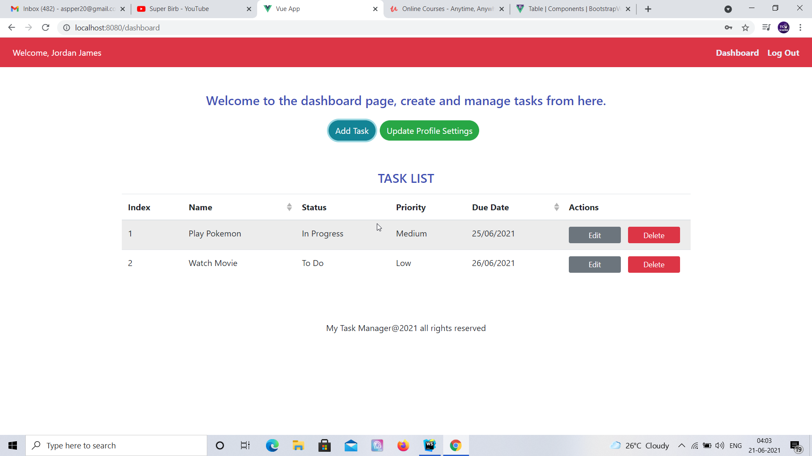

# A 'Task Manager' web application created in MEVN stack.

This one is a simple 'Task Manager' application created using MEVN stack, which uses Vue JS in place of React or Angular. For back-end Express is
used, no-sql database 'MongoDB' is used for database storage. Mongoose is used as Object Relational Mapping layer to perform queries and
fetch data. Bootstrap-Vue is used as Frontend UI kit to implement modals, tables and other components inside this application.

Some features of this application include :-

1. Contains user authentication based on JWT.
2. Create Task with name, description, due date, priority and status fields.
3. Contains full CRUD functionality for tasks.
4. Contains Sorting functionality on name and due date fields of tasks.

## Getting Started

* Clone the repo, install node modules in the main app as well as inside the frontend folder.

* Create an env file inside, put the configuration there like environment, database name and JSON web token secret.

* Make sure Node and MongoDB are installed on your system, simply run frontend and backend of the app in two terminals or you could
modify the project and use a package called 'concurrently' to run both frontend and backend of the application using a single command.
  
* Back-end by default would run on port .

* Please find the screenshots of the application attached below.

## Built With

* [Node Express](https://expressjs.com/)
* [Vue](https://vuejs.org/)
* [Bootstrap-Vue](https://bootstrap-vue.org/)
* [MongoDB and Mongoose](https://www.mongodb.com/)

## Authors

* **Amit Prafulla (APFirebolt)** - (http://apgiiit.com/)

## License

This project is licensed under the MIT License - see the [LICENSE.md](LICENSE.md) file for details

## Screenshots

Please find some screenshots of the application. Below is the screenshot depicting the dashboard page showing list of
tasks with sorting

Screenshot of the create new task modal window.

Confirmation modal, which opens when you want to delete a task from your task list.

This screenshot shows the login page of the application.

